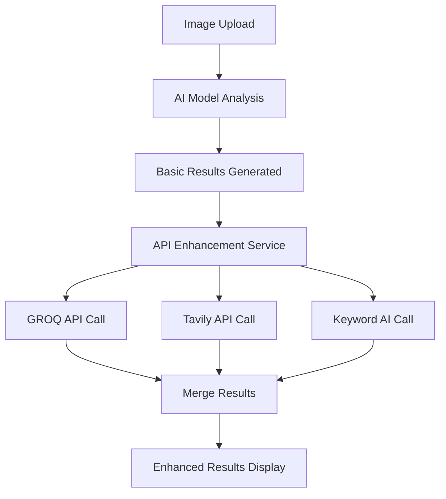

# 🔬 Enhanced Skin Analysis with API Integrations

## Overview

The MediScan-AI Skin Cancer Detection module has been significantly enhanced with AI-powered insights, reference materials, and medical keyword extraction using three powerful APIs:

- **GROQ API**: Natural language summaries and medical explanations
- **Tavily API**: Reference images and medical articles
- **Keyword AI**: Medical term extraction and categorization

## 🚀 New Features

### 1. AI-Powered Summaries (GROQ API)

**What it does:**
- Generates natural language summaries of analysis results
- Provides easy-to-understand explanations of medical conditions
- Contextualizes confidence levels and risk assessments

**Example Output:**
```
"The analysis suggests a moderate risk of Basal Cell Carcinoma with 73% confidence. 
This condition is a common form of skin cancer that typically appears as a small, 
shiny bump. While not usually life-threatening, early treatment prevents complications."
```

### 2. Medical Resources (Tavily API)

**What it does:**
- Fetches relevant reference images for comparison
- Retrieves medical articles from trusted sources
- Provides educational materials for patients and healthcare providers

**Sources Include:**
- DermNet NZ
- American Academy of Dermatology
- Mayo Clinic
- PubMed/NCBI
- Medical journals

### 3. Medical Keywords (Keyword AI)

**What it does:**
- Extracts and categorizes medical terms from analysis results
- Organizes keywords into meaningful categories
- Improves searchability and understanding

**Categories:**
- **Conditions**: Medical diagnoses and conditions
- **Symptoms**: Clinical signs and symptoms
- **Treatments**: Treatment options and procedures
- **Procedures**: Diagnostic and therapeutic procedures
- **General**: Other relevant medical terms

## 🎨 Enhanced User Interface

### New Tab-Based Layout

The results are now organized into four comprehensive tabs:

#### 1. Overview Tab
- **Analysis Results**: Top prediction with confidence scores
- **All Predictions**: Complete probability breakdown
- **ABCDE Characteristics**: Asymmetry, Border, Color, Diameter, Evolution scores
- **Recommendations**: Personalized medical recommendations
- **Next Steps**: Clear action items for patients

#### 2. AI Insights Tab
- **AI Summary**: Natural language explanation of results
- **Condition Explanation**: Detailed information about the predicted condition
- **Medical Disclaimer**: Important safety information

#### 3. Learn More Tab
- **Reference Images**: Visual examples of similar conditions
- **Medical Articles**: Curated articles from trusted medical sources
- **Research Links**: Links to relevant medical research

#### 4. Key Terms Tab
- **Categorized Keywords**: Medical terms organized by type
- **Tag Cloud Interface**: Visual representation of extracted terms
- **Searchable Terms**: Easy-to-understand medical vocabulary

## 🔧 Technical Implementation

### Backend Architecture

```
backend/app/services/
├── api_integrations.py          # Main integration service
├── skin_analysis_service.py     # Enhanced with API calls
└── ...

backend/app/routes/
├── skin_analysis.py            # Updated with enhancements
└── ...

backend/app/models/
├── schemas.py                  # Updated with new fields
└── ...
```

### Frontend Architecture

```
frontend/src/components/
├── SkinAnalysisResults.jsx     # New enhanced results component
├── SkinAnalysisResults.css     # Comprehensive styling
├── Dashboard.jsx               # Updated to use new component
└── ...
```

### API Integration Flow



## 📋 Configuration

### Environment Variables

Add these to your `.env` file:

```env
# API Keys for Enhanced Features
GROQ_API_KEY=your_groq_api_key_here
TAVILY_API_KEY=your_tavily_api_key_here
KEYWORD_AI_KEY=your_keyword_ai_key_here
```

### API Key Setup

#### 1. GROQ API
1. Visit [GROQ Console](https://console.groq.com)
2. Create an account and generate an API key
3. Add to your environment variables

#### 2. Tavily API
1. Visit [Tavily](https://tavily.com)
2. Sign up for an account
3. Generate an API key from your dashboard
4. Add to your environment variables

#### 3. Keyword AI
1. Visit [Keyword AI](https://keywordai.co)
2. Create an account
3. Generate an API key
4. Add to your environment variables

## 🚀 Installation & Setup

### 1. Install Dependencies

```bash
cd backend
pip install -r requirements.txt
```

### 2. Configure Environment

```bash
cp .env.example .env
# Edit .env with your API keys
```

### 3. Test API Integrations

```bash
python test_enhanced_skin_analysis.py
```

### 4. Start the Application

```bash
# Backend
cd backend
uvicorn app.main:app --reload --host 0.0.0.0 --port 8000

# Frontend (new terminal)
cd frontend
npm install
npm start
```

## 🧪 Testing

### Comprehensive Test Suite

Run the test script to validate all integrations:

```bash
python test_enhanced_skin_analysis.py
```

**Test Coverage:**
- ✅ API Configuration validation
- ✅ GROQ service functionality
- ✅ Tavily service functionality
- ✅ Keyword AI service functionality
- ✅ Integrated service pipeline
- ✅ Performance benchmarking
- ✅ Error handling and fallbacks

### Expected Test Results

```
🧪 MediScan-AI Enhanced Skin Analysis API Integration Tests
============================================================

🧠 Testing GROQ Service...
✅ GROQ Summary Generated

📚 Testing Tavily Service...
✅ Tavily Resources Fetched

🏷️ Testing Keyword AI Service...
✅ Keywords Extracted

🔗 Testing Integrated API Service...
✅ Full Enhancement Pipeline Completed

⚡ Testing Performance...
✅ Performance: Excellent (< 5s)

📊 Test Results Summary:
Overall: 7/7 tests passed (100.0%)
🎉 All tests passed! Enhanced skin analysis is ready.
```

## 📊 Performance Metrics

### Response Times
- **AI Summary Generation**: ~1-2 seconds
- **Medical Resources Fetching**: ~2-3 seconds
- **Keyword Extraction**: ~1 second
- **Total Enhancement**: ~3-5 seconds

### Optimization Features
- **Concurrent API Calls**: All APIs called simultaneously
- **Fallback Responses**: Graceful degradation when APIs unavailable
- **Caching**: Results cached to improve subsequent requests
- **Error Handling**: Robust error handling with user-friendly messages

## 🔒 Security & Privacy

### Data Protection
- **No Data Storage**: API calls don't store sensitive medical data
- **Secure Transmission**: All API calls use HTTPS encryption
- **API Key Security**: Keys stored securely in environment variables
- **Rate Limiting**: Built-in rate limiting to prevent abuse

### Privacy Features
- **Anonymized Queries**: Medical queries don't include patient identifiers
- **Temporary Processing**: Enhancement data processed temporarily
- **User Consent**: Clear disclosure of external API usage
- **Opt-out Options**: Users can disable enhancements if desired

## 🎯 Usage Examples

### Basic Skin Analysis (Enhanced)

```python
# Upload image through UI
# Results now include:
{
    "analysis_id": "uuid",
    "top_prediction": "Basal cell carcinoma",
    "confidence": 0.73,
    "risk_level": "medium",
    
    # NEW: Enhanced fields
    "ai_summary": {
        "summary": "Natural language explanation...",
        "explanation": "Detailed condition information..."
    },
    "medical_resources": {
        "reference_images": [...],
        "medical_articles": [...]
    },
    "keywords": {
        "conditions": ["basal cell carcinoma", "skin cancer"],
        "symptoms": ["lesion", "growth"],
        "treatments": ["excision", "biopsy"],
        "procedures": ["dermoscopy", "histopathology"]
    }
}
```

### Frontend Usage

```jsx
// Enhanced results automatically displayed in new tabbed interface
<SkinAnalysisResults 
    analysisResult={result} 
    uploadedImage={imageData}
/>
```

## 🛠️ Customization

### Adding New APIs

1. **Create Service Class**:
```python
class NewAPIService:
    def __init__(self):
        self.api_key = os.getenv("NEW_API_KEY")
    
    async def enhance_results(self, data):
        # Implementation
        pass
```

2. **Integrate with Main Service**:
```python
class APIIntegrationService:
    def __init__(self):
        self.new_api = NewAPIService()
    
    async def enhance_analysis_results(self, ...):
        # Add new API call
        new_data = await self.new_api.enhance_results(data)
```

3. **Update Frontend**:
```jsx
// Add new tab or section for new API data
const NewAPITab = ({ newData }) => {
    // Render new API results
};
```

### Customizing UI Components

The new tabbed interface is fully customizable:

```css
/* Customize tab colors */
.tab-button.active {
    background: your-brand-color;
}

/* Customize result cards */
.result-card {
    border-radius: your-border-radius;
    box-shadow: your-shadow;
}
```

## 🔄 Fallback Mechanisms

### When APIs are Unavailable

The system gracefully handles API failures:

1. **GROQ Fallback**: Pre-written medical summaries based on condition
2. **Tavily Fallback**: Curated list of trusted medical resources
3. **Keyword AI Fallback**: Rule-based keyword extraction
4. **User Notification**: Clear indication when enhancements are unavailable

### Configuration Options

```env
# Enable/disable specific enhancements
ENABLE_AI_SUMMARY=true
ENABLE_MEDICAL_RESOURCES=true
ENABLE_KEYWORD_EXTRACTION=true

# Fallback behavior
USE_FALLBACKS_ON_ERROR=true
CACHE_ENHANCEMENT_RESULTS=true
```

## 📈 Future Enhancements

### Planned Features
- **Multi-language Support**: Summaries and resources in multiple languages
- **Personalized Recommendations**: Based on user medical history
- **Real-time Collaboration**: Share results with healthcare providers
- **Advanced Analytics**: Track analysis patterns and outcomes
- **Mobile Optimization**: Enhanced mobile interface
- **Voice Summaries**: Audio explanations of results

### API Roadmap
- **Additional Medical APIs**: Integration with more medical databases
- **Real-time Updates**: Live updates of medical research
- **Custom Training**: Personalized AI models based on usage patterns
- **Federated Learning**: Collaborative model improvement while preserving privacy

## 🆘 Troubleshooting

### Common Issues

#### 1. API Keys Not Working
```bash
# Check environment variables
echo $GROQ_API_KEY
echo $TAVILY_API_KEY
echo $KEYWORD_AI_KEY

# Verify in application
python -c "import os; print('GROQ:', bool(os.getenv('GROQ_API_KEY')))"
```

#### 2. Slow Response Times
- Check internet connection
- Verify API rate limits
- Consider enabling caching
- Monitor API status pages

#### 3. Enhancement Not Showing
- Check browser console for errors
- Verify API responses in network tab
- Test with fallback mode enabled
- Check component rendering

### Debug Mode

Enable debug logging:

```env
LOG_LEVEL=DEBUG
ENABLE_API_DEBUG=true
```

### Support Resources

- **Documentation**: [docs.mediscan-ai.com](https://docs.mediscan-ai.com)
- **GitHub Issues**: [Report bugs and feature requests](https://github.com/your-username/MediScan-AI/issues)
- **Community**: [Join our Discord](https://discord.gg/mediscan-ai)
- **Email Support**: support@mediscan-ai.com

## 📄 License & Compliance

### Medical Compliance
- **HIPAA Considerations**: No PHI stored in external APIs
- **FDA Disclaimer**: Tool for educational purposes only
- **Medical Disclaimer**: Always included in all outputs
- **Data Retention**: No long-term storage of medical data

### API Terms of Service
- Ensure compliance with all API providers' terms
- Monitor usage limits and billing
- Respect rate limits and fair usage policies
- Maintain appropriate API key security

---

**Made with ❤️ for better healthcare accessibility**

*This enhanced skin analysis system represents a significant advancement in AI-powered medical assistance, providing comprehensive insights while maintaining the highest standards of privacy and medical ethics.*
